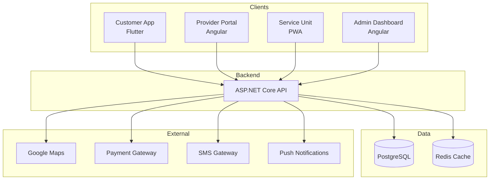

# Technical Architecture

## Technology Stack

| Component | Technology | Rationale |
|-----------|------------|-----------|
| Customer App | Flutter | Cross-platform, single codebase |
| Backend API | ASP.NET Core | Team expertise, Azure integration |
| Database | Azure PostgreSQL | Scalability, geospatial support |
| Web Apps | Angular | Modern SPA, TypeScript |
| Service Unit | Angular PWA | Native-like without app store |
| Cloud | Microsoft Azure | Qatar region, integrated ecosystem |
| CI/CD | GitHub Actions | Free tier, good integration |

## System Architecture

## External Integrations

### Critical (MVP)

| Service | Provider | Purpose |
|---------|----------|---------|
| Maps | Google Maps API | Location, routing |
| Payments | QNB, QIIB | Local card processing |
| SMS | Qatar provider | OTP, notifications |
| Push | Firebase FCM | Real-time updates |

### Future (Phase 2+)

- Document verification for provider onboarding
- Accounting integration (QuickBooks, SAP)
- IoT for equipment monitoring

## Security

### Data Protection
- AES-256 encryption at rest
- TLS 1.3 for all communications
- PCI DSS compliance for payments

### Authentication
- JWT tokens with refresh mechanism
- SMS-based OTP verification
- Role-based access control
- Session timeout after 30 minutes

### API Security
- Rate limiting
- DDoS protection
- Regular vulnerability assessments
